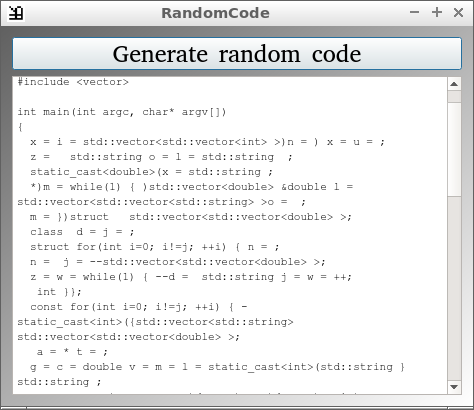

# RandomCode

RandomCode is a simple tool that creates random C++ code. 
I wrote it for the forums I visited: 
when somebody was begging for code 
('Coult u pleaz gimme code 4 peer2peer programm?'), 
I posted a piece of random generated code with the comment 
'Here it is, it just needs to have some bugs fixed!'. 
Programmers' humor is great, isn't it? 

 * [Download the latest version of 'Random Code'](https://richelbilderbeek.nl/ToolRandomCodeConsoleExe.zip)
 * [Download 'Random Code' v3.0](https://richelbilderbeek.nl/ToolRandomCodeConsoleExe.zip)

The Windows executable of version 3.0 is created following
[how to cross-compile a Qt Creator project from Ubuntu to a windows executable: example 15: MinGW cross-compiling environment](https://richelbilderbeek.nl/CppQtCrosscompileToWindowsExample15.htm)

